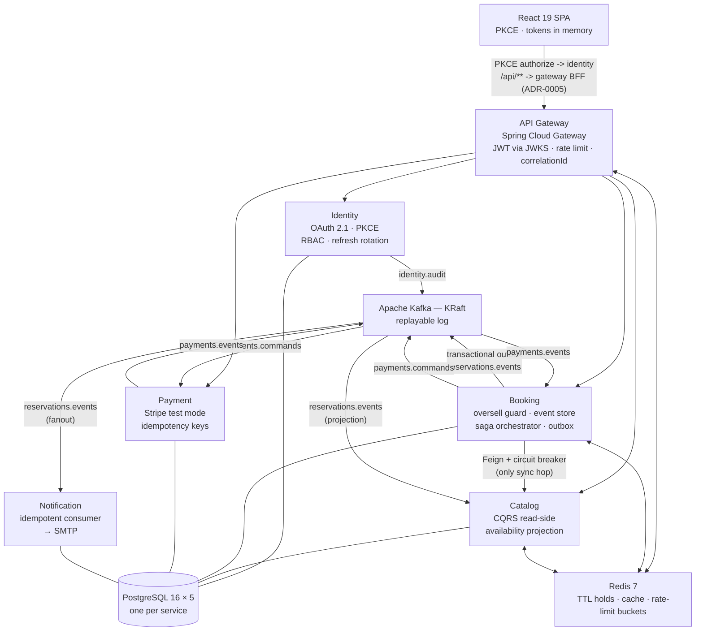

# STAMPEDE

**High-concurrency event ticketing that proves zero oversells under 1,000-VU flash-sale load.**

[](https://github.com/stampede-io/STAM-catalog/actions/workflows/ci.yml?query=branch%3Amain)
[](https://github.com/stampede-io/STAM-booking/actions/workflows/ci.yml?query=branch%3Amain)
[](https://github.com/stampede-io/STAM-payment/actions/workflows/ci.yml?query=branch%3Amain)
[](https://github.com/stampede-io/STAM-identity/actions/workflows/ci.yml?query=branch%3Amain)
[](https://github.com/stampede-io/STAM-gateway/actions/workflows/ci.yml?query=branch%3Amain)
[](https://github.com/stampede-io/STAM-frontend/actions/workflows/ci.yml?query=branch%3Amain)
[](https://github.com/stampede-io/STAM-platform/actions/workflows/nightly.yml)
[](https://github.com/stampede-io/STAM-platform/releases/tag/v0.2.0)

> **Nightly E2E is currently red** — two known workflow bugs (compose build-context path and a missing dev server in CI), not product regressions. Tracked for Sprint 3.
>
> **Milestone 2 demo video:** *(link goes here after recording)*

## The problem

Ticket drops break systems. When a single "50,000 seats, on sale in 10 seconds" event lands, the two things everybody remembers are the ones you can never take back: the same seat sold twice, and the payment charged but ticket never issued. STAMPEDE is a portfolio-grade study of the specific patterns that keep those two failures from happening — orchestrated sagas, event sourcing, transactional outbox, partial-unique indexes as an oversell guard of last resort — under real load.

## Milestone 2 numbers

Secured flash-sale: 1,000 VUs over 100 s, single show, 100-seat pool, 200 pre-authenticated users, full **hold → pay → confirm** flow routed **through the gateway** with per-request JWT validation and Redis rate limiting.

| Metric                       | Threshold | M1 (direct) | M2 (through gateway) |
|------------------------------|-----------|-------------|----------------------|
| VUs (peak)                   | ≥ 1,000   | 1,000       | **1,000**            |
| Total HTTP requests          | —         | 424,726     | 101,890              |
| Reservations confirmed       | —         | 100 / 100   | **100 / 100**        |
| **Oversells (DB invariant)** | **0**     | **0** ✓     | **0** ✓              |
| `http_req_failed`            | < 1 %     | 64 %        | **0.00 %** ✓         |
| `http_req_duration` p99      | < 300 ms  | 716 ms      | 5.29 s ✗             |
| Saga convergence p99         | —         | —           | 1.35 s               |

**100 seats offered, 100 holds granted, 100 reservations confirmed, out of 100,356 concurrent attempts.** Every losing request got a clean 409.

The p99 gate is met up to ~300 VUs and misses beyond it. That is single-node saturation of the one gateway container on laptop hardware — throughput halves between 400 and 500 VUs while `http_req_failed` stays at 0.00 %, the signature of a queue, not an error. The gateway is stateless (rate-limit state lives in Redis), so Sprint 3's Kubernetes work scales it horizontally. **The oversell invariant held in all eight runs, at every VU level tested.**

Full report with knee-point sweep and bottleneck analysis: [`load-tests/results/flash-sale-secured-20260822-m2.md`](load-tests/results/flash-sale-secured-20260822-m2.md). M1 baseline: [`flash-sale-20260720-5690039.md`](load-tests/results/flash-sale-20260720-5690039.md).

## Architecture



The gateway → service edges (`GW --> ID/CAT/BK/PAY`) are HTTP routing. Between the business services, every edge is Kafka — except **booking → catalog**, a synchronous OpenFeign call for seat validation behind a Resilience4j circuit breaker so a catalog outage degrades booking rather than taking it down (`CircuitBreakerIT`).

> **The SPA → gateway edge is proven (STAM-440).** A Playwright spec with no `page.route()` mocks drives the real SPA through the real gateway — PKCE login against identity's own form, a seat map from catalog, a hold through booking. The gateway's BFF token handler (ADR-0005) keeps the refresh token in an httpOnly cookie; the SPA holds only the access token. The frontend runs as its own service in `docker-compose.yml`.

**Key invariants:**

- **Oversell guard of last resort:** a partial unique index on `reservation_seats (show_id, seat_id) WHERE status IN ('HELD','CONFIRMED')` — the database itself rejects a second live hold for the same seat. The insert *failing* is the mechanism; it surfaces as HTTP 409.
- **Saga crash recovery:** every saga instance is a durable row in `saga_instances` carrying `state`, `step`, and `updated_at`. A periodic recovery sweep re-drives any saga stuck past its deadline, so a `kill -9` mid-flow converges once the process comes back (`SagaRecoveryIT`).
- **Transactional outbox:** service state and the "please publish this Kafka event" row are written in the same DB transaction; a separate publisher polls the outbox and marks rows sent. Nothing is lost if the process dies between commit and publish — this gives **at-least-once** delivery.
- **Idempotent consumers:** at-least-once plus `processed_events` (catalog, notification) and `idempotency_keys` (payment) de-duplicates redelivered events, so the read-model projection and payment state converge exactly once. The email side is best-effort de-dup, not transactional — a crash between SMTP send and the `processed_events` write can still double-send (fine for Mailhog; a real relay would need a claimed/pending state).

## Quickstart

```bash
git clone https://github.com/stampede-io/STAM-platform
cd STAM-platform && bash scripts/clone-all.sh
cd compose-dev
cp .env.example .env          # if not already present
docker compose up -d --wait
```

Front door is the **gateway on `:8085`**. Services are also exposed directly for debugging:

```bash
curl http://localhost:8085/actuator/health   # gateway  (use this for real traffic)
curl http://localhost:8084/actuator/health   # identity
curl http://localhost:8081/actuator/health   # catalog
curl http://localhost:8082/actuator/health   # booking
curl http://localhost:8083/actuator/health   # payment
curl http://localhost:8086/actuator/health   # notification
```

Kafka UI: `http://localhost:8080` · Mailhog inbox: `http://localhost:8025` · Eureka: `http://localhost:8761`

## Try it

Hold a seat, pay, confirm. These hit services directly, which skips auth — going through the gateway on `:8085` requires a bearer token from the PKCE flow.

```bash
# 1. list shows
curl http://localhost:8081/api/v1/shows | jq

# 2. list seats for a show
SHOW_ID=<uuid-from-above>
curl "http://localhost:8081/api/v1/shows/$SHOW_ID/seats" | jq

# 3. hold
SEAT_ID=<uuid-from-above>
curl -X POST http://localhost:8082/api/v1/reservations \
  -H "Content-Type: application/json" \
  -H "Idempotency-Key: $(uuidgen)" \
  -d "{\"showId\":\"$SHOW_ID\",\"userId\":\"$(uuidgen)\",\"seatIds\":[\"$SEAT_ID\"]}"

# 4. submit payment (starts saga)
RES_ID=<reservationId from previous response>
curl -X POST http://localhost:8082/api/v1/reservations/$RES_ID/submit-payment

# 5. poll for CONFIRMED
curl http://localhost:8082/api/v1/reservations/$RES_ID | jq

# 6. confirmation email lands in Mailhog
open http://localhost:8025
```

Force a compensation path by setting `PAYMENT_FAILURE_RATE=1.0` in `.env` and restarting payment — the saga will refund and release the seats instead of confirming.

## Load testing

```bash
# unsecured baseline (M1 shape — straight to booking)
bash load-tests/k6/run-flash-sale.sh

# secured (M2 shape — through the gateway with real JWTs)
bash load-tests/k6/run-flash-sale-secured.sh

# knee-point sweep at a fixed VU level
CONSTANT_VUS=300 CONSTANT_DURATION=20s bash load-tests/k6/run-flash-sale-secured.sh
```

Each runner discovers a seed show, resolves its seat IDs, invokes k6, writes both a `--summary-export` JSON and a stdout capture to `load-tests/results/flash-sale-<date>-<sha>.{json,txt}`, and then runs the DB-level oversell check as a hard `PASS/FAIL` gate.

Contention-only test (hold path, no payment): [`load-tests/k6/contention.js`](load-tests/k6/contention.js).
Rate-limit burst test: [`load-tests/rate-limit-burst.js`](load-tests/rate-limit-burst.js).

## Architecture decisions

| ADR   | Decision | Status |
|-------|----------|--------|
| [0001](docs/adr/0001-microservices-over-modular-monolith.md) | Microservices over modular monolith | Accepted |
| [0002](docs/adr/0002-orchestrated-saga-over-choreography.md) | Orchestrated saga (state machine in booking) over choreography | Accepted |
| [0003](docs/adr/0003-kafka-over-rabbitmq-and-sqs.md)         | Kafka as the event backbone (replayable log, per-partition ordering) | Accepted |
| [0004](docs/adr/0004-k8s-dns-over-eureka.md)                 | K8s DNS instead of Eureka | Proposed — completed in Sprint 3 |

## Repository layout (polyrepo)

Each service is its own git repo under the [`stampede-io`](https://github.com/stampede-io) org. This one, `STAM-platform`, is the shared-infra repo.

| Repo | Role |
|------|------|
| [STAM-gateway](https://github.com/stampede-io/STAM-gateway) | Spring Cloud Gateway — JWT validation, Redis rate limiting, correlation IDs |
| [STAM-identity](https://github.com/stampede-io/STAM-identity) | OAuth 2.1 Authorization Server — PKCE, RBAC, rotating refresh tokens |
| [STAM-catalog](https://github.com/stampede-io/STAM-catalog) | CQRS read-side — venue/event/show/seat CRUD, availability projection |
| [STAM-booking](https://github.com/stampede-io/STAM-booking) | Event-sourced reservation ledger + saga orchestrator |
| [STAM-payment](https://github.com/stampede-io/STAM-payment) | Stripe test-mode payment service, idempotency keys, saga command consumer |
| [STAM-notification](https://github.com/stampede-io/STAM-notification) | Idempotent Kafka consumer for booking emails |
| [STAM-frontend](https://github.com/stampede-io/STAM-frontend) | React + Vite + TS SPA — seat map, checkout, PKCE auth |
| **STAM-platform** *(this repo)* | Compose dev env, config repo, ADRs, load tests, Helm/Terraform (Sprint 3), nightly e2e |
| [STAM-gitops](https://github.com/stampede-io/STAM-gitops) | ArgoCD source of truth — app-of-apps, staging/prod manifests (Sprint 3) |

## Observability

Every log line is structured JSON. A `correlationId` MDC field, minted at the gateway, threads a single business transaction through every service and rides on `EventEnvelope.correlationId` through Kafka:

```bash
docker compose logs -f booking payment | jq -r 'select(.correlationId) | "\(.service)\t\(.correlationId)\t\(.message)"'
```

The same `correlationId` appears in booking log lines (saga started, `PaymentAuthorized` received, reservation confirmed) and in payment log lines (`AuthorizePayment` received, outcome emitted) for the same transaction.

## Status

**Milestone 2 (tag: `v0.2.0`) — complete.** Secured stack: OAuth 2.1 identity service, API gateway with JWT validation and Redis rate limiting, Stripe test-mode payments, notification emails, React SPA with a PKCE checkout flow. Built on the zero-oversell core from `v0.1.0`. All backend Testcontainers integration tests green across seven repos.

Test coverage is two separate layers today: 38 Playwright E2E specs exercise the SPA against **mocked** API responses, and a secured k6 flash-sale drives the **gateway and backend** with real JWTs (0 oversells at 1,000 VUs). A real browser-through-gateway test is still open — the SPA→gateway wiring has a known bug (dev proxy port, unrouted auth paths, frontend not in compose), so "full browser journey verified end to end" is **not** yet an accurate claim.

**Milestone 1 (tag: `v0.1.0`) — complete.** Compose-based deploy, catalog + booking + payment + Kafka + Redis + Postgres. Full hold → pay → confirm saga with compensation and crash recovery.

**In progress — Sprint 3 (`v0.3.0`):** Kubernetes-native deployment — raw manifests on kind, Terraform for Azure VM + k3s, Helm umbrella chart, shared Postgres and Redis on cluster, Sealed Secrets, ArgoCD app-of-apps. Eureka and Config Server get deleted, fulfilling ADR-0004.

## License

See [LICENSE](LICENSE).
