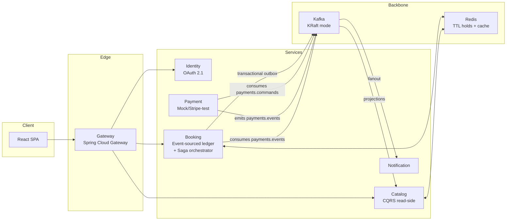

# STAMPEDE

**High-concurrency event ticketing that proves zero oversells under 1,000-VU flash-sale load.**

[](https://github.com/stampede-io/STAM-platform/actions/workflows/nightly.yml)
[](https://github.com/stampede-io/STAM-catalog/actions/workflows/ci.yml)
[](https://github.com/stampede-io/STAM-booking/actions/workflows/ci.yml)
[](https://github.com/stampede-io/STAM-payment/actions/workflows/ci.yml)
[](https://github.com/stampede-io/STAM-platform/releases/tag/v0.1.0)

> **Milestone 1 demo video:** *(link goes here after recording — see [STAM-209](https://puliththewmika-dev.atlassian.net/browse/STAM-209))*

## The problem

Ticket drops break systems. When a single "50,000 seats, on sale in 10 seconds" event lands, the two things everybody remembers are the ones you can never take back: the same seat sold twice, and the payment charged but ticket never issued. STAMPEDE is a portfolio-grade study of the specific patterns that keep those two failures from happening — orchestrated sagas, event sourcing, transactional outbox, partial-unique indexes as an oversell guard of last resort — under real load.

## Milestone 1 numbers

Flash-sale scenario: 1,000 VUs ramping over 100 s, single show, 100-seat pool, full **hold → pay → confirm** flow through the saga.

| Metric              | Threshold          | M1 result          |
|---------------------|--------------------|--------------------|
| VUs (peak)          | ≥ 1,000            | **1,000**          |
| Total HTTP requests | —                  | **424,726**        |
| Reservations confirmed | —              | **100 / 100**      |
| **Oversells (DB invariant)** | **0**     | **0** ✓            |
| `http_req_duration` p99 | < 300 ms       | 716 ms (single-node saturation) |
| `http_req_failed`   | < 1 %              | 64 % (single-node saturation) |

The oversell invariant holds under 1,000 VUs. The two transport-level thresholds miss due to single-node HikariCP saturation — infrastructure tuning, not a correctness bug. Full report and analysis: [`load-tests/results/flash-sale-20260720-5690039.md`](load-tests/results/flash-sale-20260720-5690039.md).

## Architecture



**Key invariants:**

- **Oversell guard of last resort:** a partial unique index on `reservation_seats(show_id, seat_id) WHERE status IN ('HELD','CONFIRMED')` — the database itself rejects a second live hold for the same seat.
- **Saga crash recovery:** every saga instance is a durable row in `saga_instances` with a `next_action` and `updated_at`. A boot-time sweep and a periodic scheduler re-drive any saga stuck past its deadline, so a `kill -9` mid-flow converges once the process comes back.
- **Transactional outbox:** service state and the "please publish this Kafka event" row are written in the same DB transaction; a separate publisher polls the outbox and marks rows sent. Nothing is lost if the process dies between commit and publish.

## Quickstart

```bash
git clone https://github.com/stampede-io/STAM-platform
cd STAM-platform/compose-dev
cp .env.example .env          # if not already present
docker compose up -d --build --wait

# Health check
curl http://localhost:8081/actuator/health   # catalog
curl http://localhost:8082/actuator/health   # booking
curl http://localhost:8083/actuator/health   # payment
```

Kafka UI: `http://localhost:8080`.

Clone every repo at once:

```bash
./scripts/clone-all.sh
```

## Try it

Hold a seat, pay, confirm:

```bash
# 1. list shows
curl http://localhost:8081/api/v1/shows | jq

# 2. list seats for a show
SHOW_ID=<uuid-from-above>
curl "http://localhost:8081/api/v1/shows/$SHOW_ID/seats" | jq

# 3. hold
SEAT_ID=<uuid-from-above>
curl -X POST http://localhost:8082/api/v1/reservations \
  -H "Content-Type: application/json" \
  -H "Idempotency-Key: $(uuidgen)" \
  -d "{\"showId\":\"$SHOW_ID\",\"userId\":\"$(uuidgen)\",\"seatIds\":[\"$SEAT_ID\"]}"

# 4. submit payment (starts saga)
RES_ID=<reservationId from previous response>
curl -X POST http://localhost:8082/api/v1/reservations/$RES_ID/submit-payment

# 5. poll for CONFIRMED
curl http://localhost:8082/api/v1/reservations/$RES_ID | jq
```

## Load testing

The k6 flash-sale scenario lives at [`load-tests/k6/flash-sale.js`](load-tests/k6/flash-sale.js).

```bash
# from repo root, after `docker compose up`:
bash load-tests/k6/run-flash-sale.sh
```

The runner discovers a seed show, resolves its seat IDs, invokes k6, writes both a `--summary-export` JSON and a stdout capture to `load-tests/results/flash-sale-<date>-<sha>.{json,txt}`, and then runs the DB-level oversell check as a hard gate on `PASS/FAIL`.

Contention-only test (hold path, no payment): [`load-tests/k6/contention.js`](load-tests/k6/contention.js).

## Architecture decisions

| ADR   | Decision |
|-------|----------|
| [0001](docs/adr/0001-microservices-over-modular-monolith.md) | Microservices over modular monolith |
| [0002](docs/adr/0002-orchestrated-saga-over-choreography.md) | Orchestrated saga (state machine in booking) over choreography |
| [0003](docs/adr/0003-kafka-over-rabbitmq-and-sqs.md)         | Kafka as the event backbone (replayable log, per-partition ordering) |
| [0004](docs/adr/0004-k8s-dns-over-eureka.md)                 | K8s DNS instead of Eureka (Sprint 3) |

## Repository layout (polyrepo)

Each service is its own git repo under the [`stampede-io`](https://github.com/stampede-io) org. This one, `STAM-platform`, is the shared-infra repo.

| Repo | Role |
|------|------|
| [STAM-gateway](https://github.com/stampede-io/STAM-gateway) | Spring Cloud Gateway — JWT validation, Redis rate limiting, correlation IDs |
| [STAM-identity](https://github.com/stampede-io/STAM-identity) | OAuth 2.1 Authorization Server — PKCE, RBAC, rotating refresh tokens |
| [STAM-catalog](https://github.com/stampede-io/STAM-catalog) | CQRS read-side — venue/event/show/seat CRUD, availability projection |
| [STAM-booking](https://github.com/stampede-io/STAM-booking) | Event-sourced reservation ledger + saga orchestrator |
| [STAM-payment](https://github.com/stampede-io/STAM-payment) | Mock/Stripe-test payment service, idempotency keys, saga command consumer |
| [STAM-notification](https://github.com/stampede-io/STAM-notification) | Idempotent Kafka consumer for booking/payment emails |
| [STAM-frontend](https://github.com/stampede-io/STAM-frontend) | React + Vite + TS SPA — seat map, checkout, PKCE auth |
| **STAM-platform** *(this repo)* | Compose dev env, Helm charts, Terraform, ADRs, load tests, nightly e2e |
| [STAM-gitops](https://github.com/stampede-io/STAM-gitops) | ArgoCD source of truth — app-of-apps, staging/prod manifests |

## Observability

Every log line is structured JSON. A `correlationId` MDC field threads a single business transaction through booking-service and payment-service:

```bash
docker compose logs -f booking payment | jq -r 'select(.correlationId) | "\(.service)\t\(.correlationId)\t\(.message)"'
```

The same `correlationId` appears in booking log lines (saga started, PaymentAuthorized received, reservation confirmed) and in payment log lines (AuthorizePayment received, outcome emitted) for the same transaction.

## Status

**Milestone 1 (tag: `v0.1.0`) — complete.** Compose-based deploy, catalog + booking + payment + Kafka + Redis + Postgres. Full hold → pay → confirm saga with compensation and crash recovery. 74/74 booking tests and 6/6 payment tests pass. Contention test (ContentionIT) and saga recovery test (SagaRecoveryIT) both green.

**Not yet in scope (planned Sprint 2+):** identity/OAuth, gateway rate limiting, notification service, React frontend, K8s deploy, ArgoCD.

## License

See [LICENSE](LICENSE).
